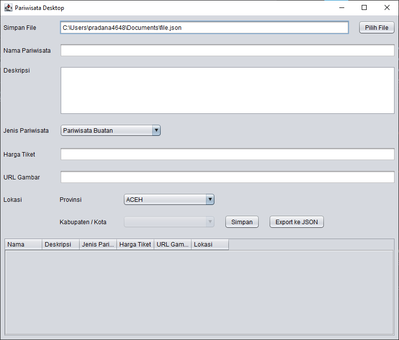

# pariwisata-desktop-application
Digunakan sebagai data entry dalam bentuk DESKTOP untuk REST API

# Tutorial

1. Buat file dengan ekstensi `.json`
2. Masukkan datanya 
3. Klik Simpan
4. Atau bisa lakukan export

## Fitur
- [x] Export file
- [ ] Load JSON file
- [ ] Update
- [ ] Delete
